# JavaFX Metronic Theme

A modern, responsive JavaFX theme library inspired by the Metronic design system, implementing Tailwind CSS concepts for JavaFX applications.

## Screenshots

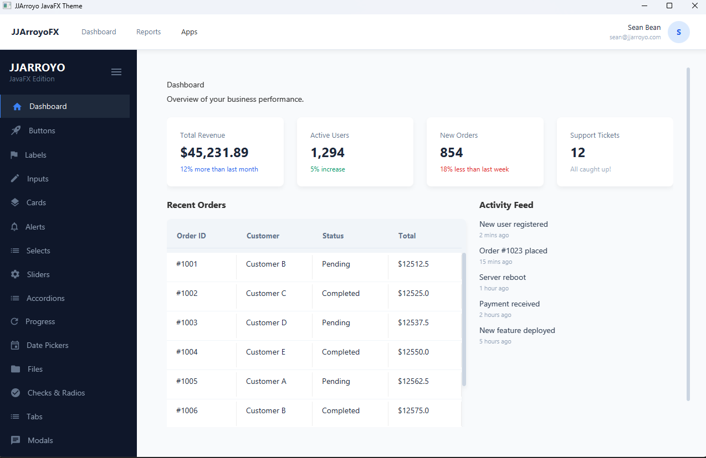

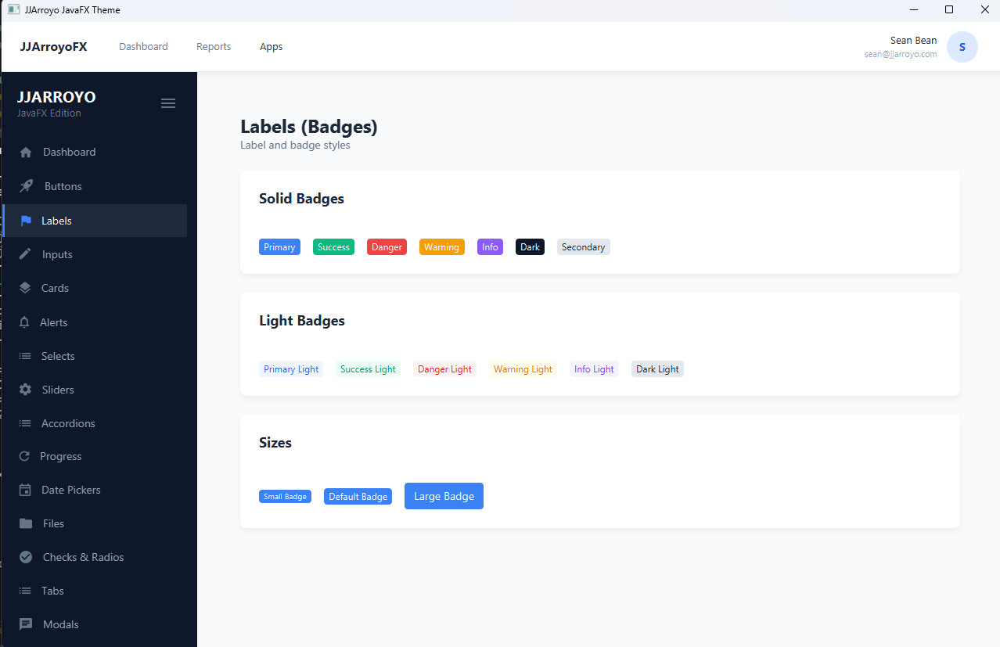
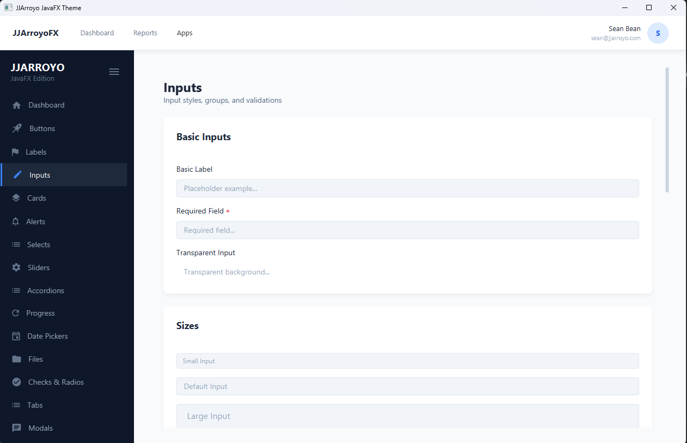
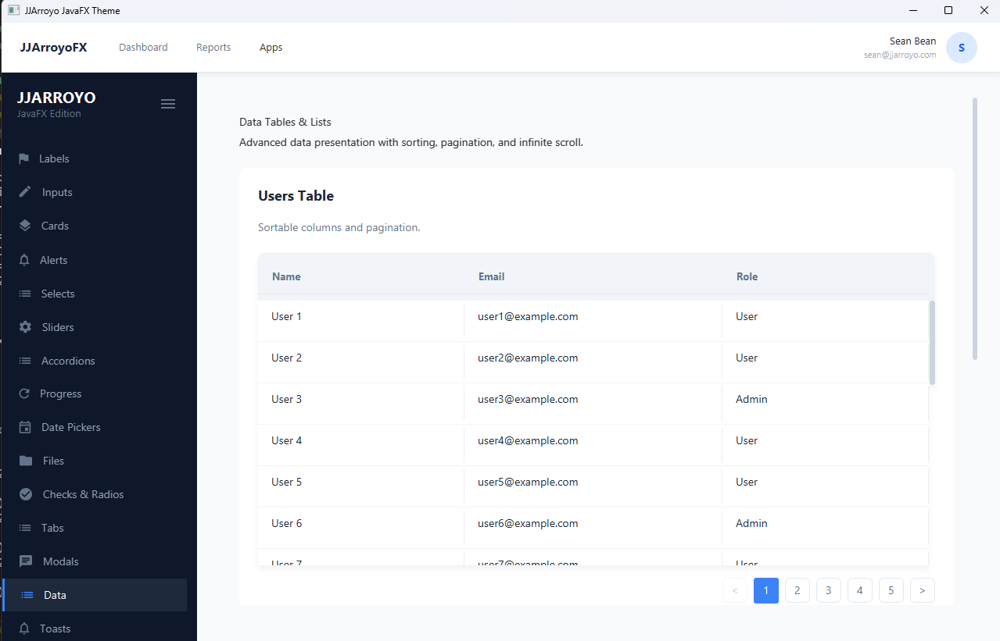

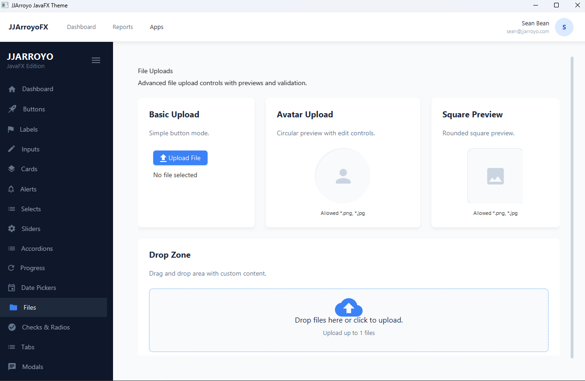
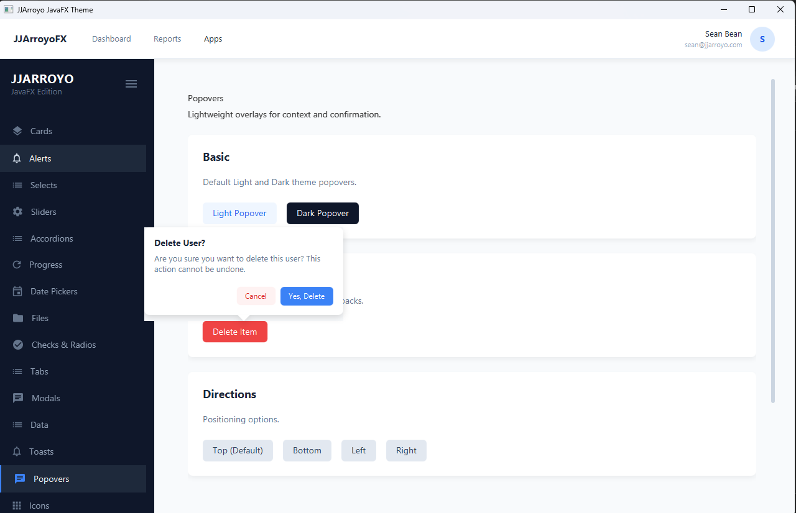
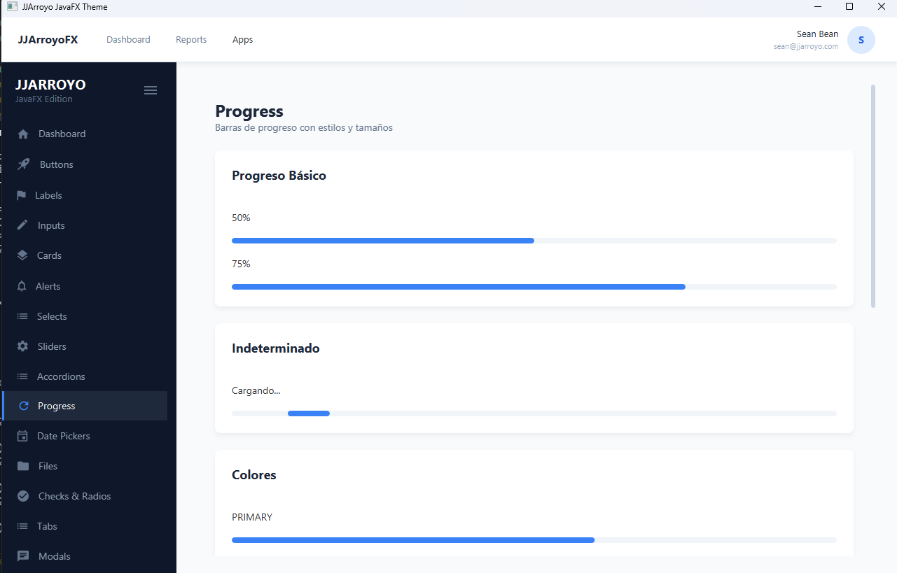
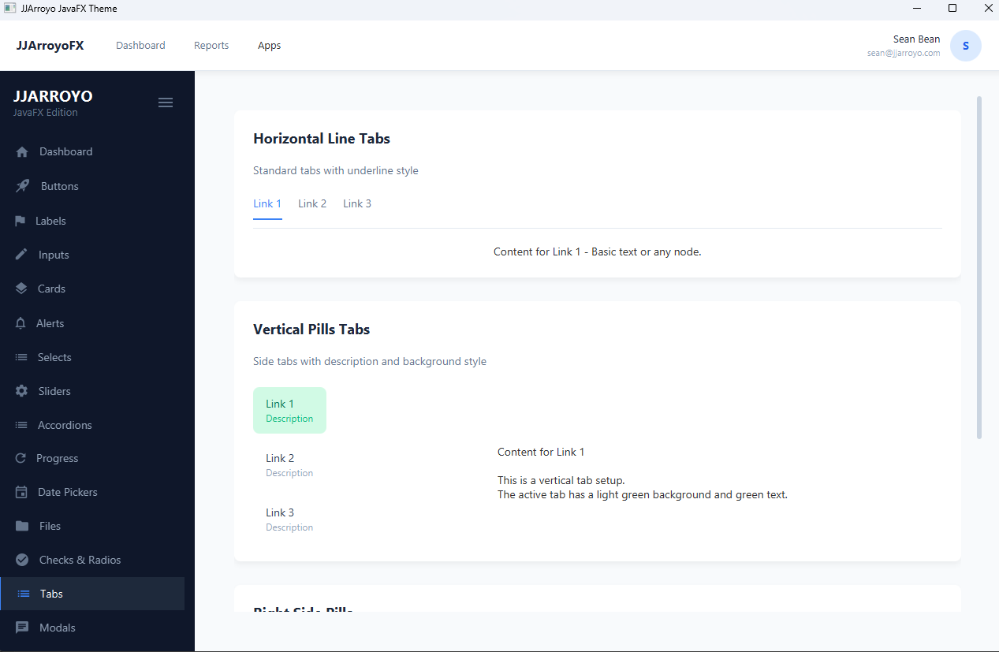
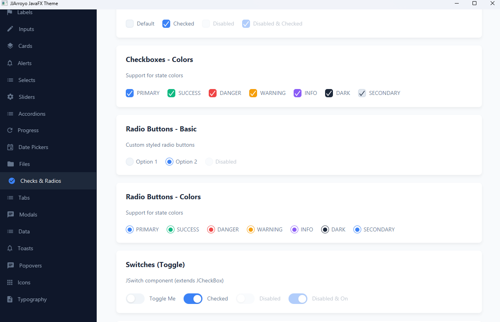
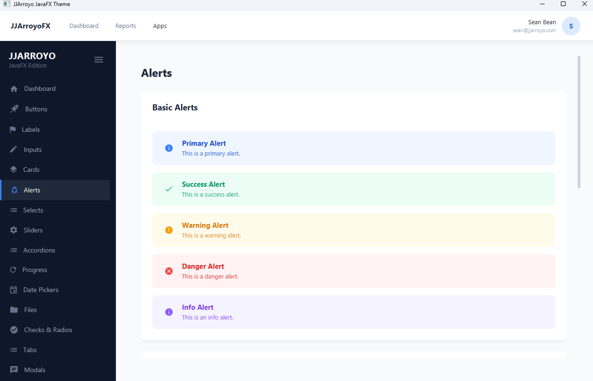

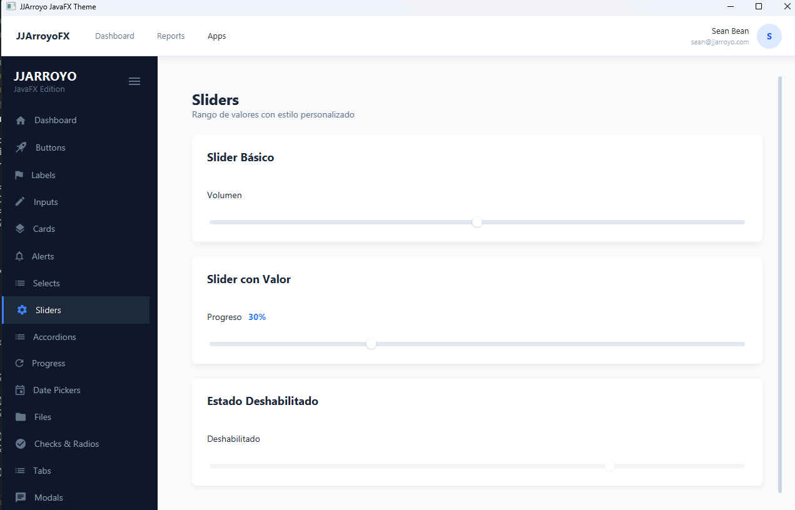

## Component Library

The core of this project is the `jjarroyo-library` which provides a set of custom controls and styles for JavaFX.

## Demo Application

A demonstration application is included in `jjarroyo-demo` to showcase the components and theme capabilities.

## Documentation

Full documentation and component previews are available in the `docs` folder.

[View Documentation](./docs/index.html)

## Installation

Run the project with Maven using the provided `run.bat` script or through your IDE.

## License

[MIT](LICENSE)
